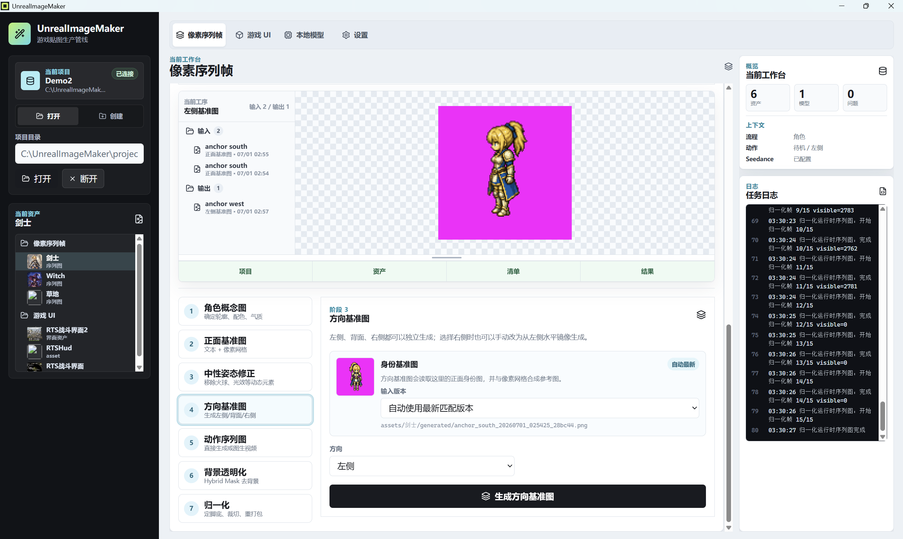
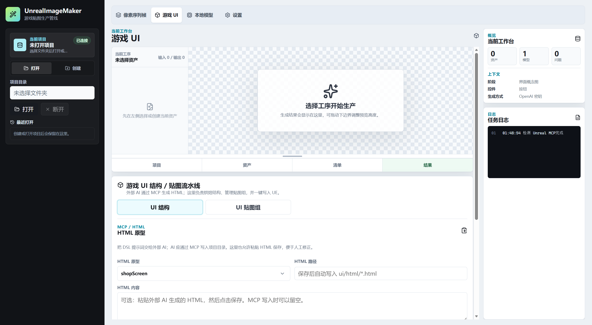
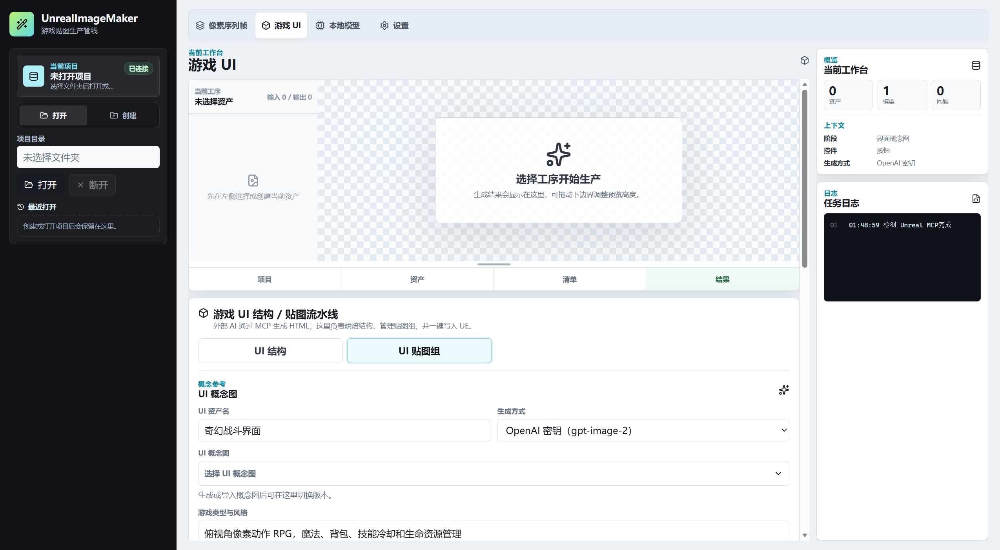
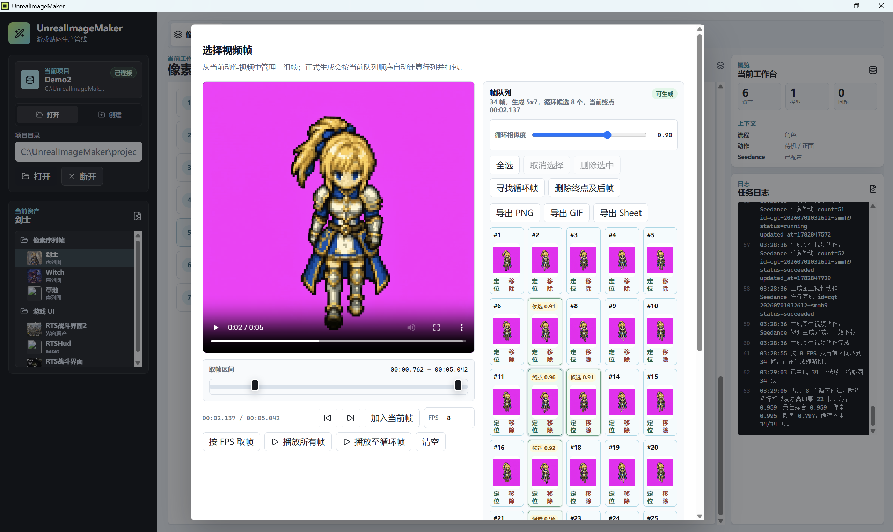
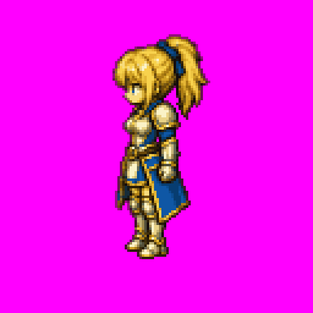
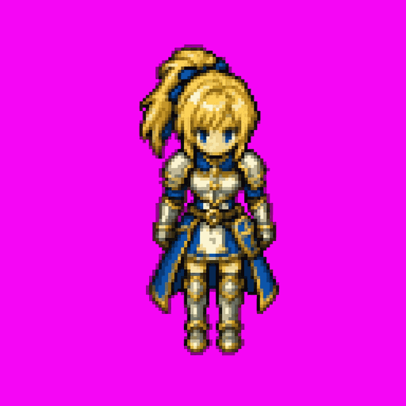
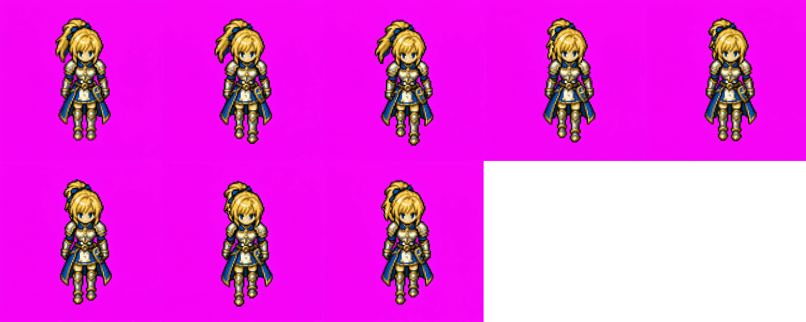
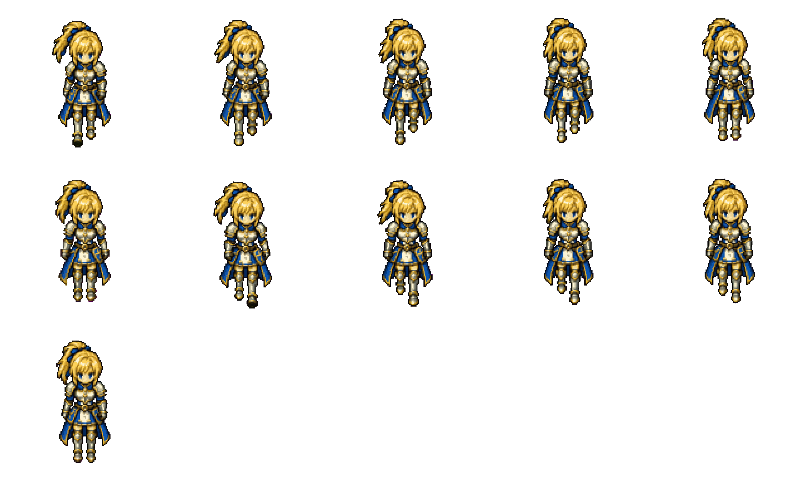
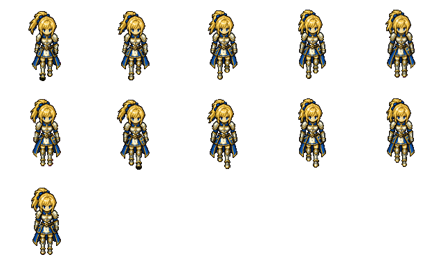
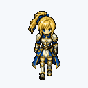

# UnrealImageMaker

UnrealImageMaker 是一个面向 Unreal Engine 美术资产管线的本地桌面工具。

## 项目要点

- 桌面端使用 Tauri 2，前端使用 React、TypeScript 和 Vite。
- 后端使用 Python worker，负责项目文件、图像处理、AI provider 和 Unreal 导出。
- 资产以目录型 `.uim` 项目保存，生成结果、版本记录和 JSON manifest 都落在项目目录中。
- 支持 OpenAI API 图像生成，以及实验性的 ChatGPT 订阅账号生成入口。
- 支持 rembg 背景移除和像素 / UI 资产后处理。
- 内置像素 Spritesheet 和游戏 UI 两个主要工作台。
- Unreal 集成优先检测 MCP bridge；MCP 不可用或能力不足时生成 Unreal Python 兜底导入脚本。

## 关键界面截图

> 下面截图包含 Playwright 生成的工作台首屏，以及实际生成视频后的截帧界面。

| 功能 | 截图 |
| --- | --- |
| 像素 Spritesheet 工作台 |  |
| 游戏 UI 结构 / HTML / UMG 工作流 |  |
| UI 贴图组工作流 |  |
| 生成视频后的截帧 UI |  |

### 案例：剑士行走动画

“剑士”示例资产展示了一条典型的游戏角色动作创建流程：先确定可动画化的基准图，再用基准图生成行走视频，最后从视频中取帧并进入后处理。透明化和归一化示例使用同一角色资产的后处理产物。

| 阶段 | 产物 |
| --- | --- |
| 正面基准图：把角色收敛到可动画化的单帧造型；该资产使用 `128` 逻辑帧尺寸和 `512x512` 基准图输出。 |  |
| 方向基准图：补齐侧向读形，后续可用于多方向动作。 |  |
| 图生视频：用角色基准图生成正面行走视频，再进入截帧 UI 按 FPS 和循环相似度挑选候选帧。 |  |
| 导出 Sheet：把选中的行走帧打包成 `sheet:walk:south`。 |  |
| 背景透明化：移除 key color 背景，保留角色像素和描边。 |  |
| 归一化 Sheet：统一帧尺寸、角色落点和运行时图集布局。 |  |
| 归一化动图：用归一化后的帧生成循环预览，便于快速检查动作节奏。 |  |

## 功能详情

### `.uim` 项目与 Manifest

`.uim` 是目录型项目格式，项目内保存 `project.uim.json`、`models.lock.json`、资产文件、导出文件和缓存。资产最终会被编译成 JSON manifest，引擎适配层只消费 manifest 和生成文件，不直接依赖 AI 模型输出。

当前 manifest 覆盖 texture、spritesheet、animation、ui_kit 和 nine_slice 等资产类型，并带有基础校验规则、处理链记录和 Unreal 目标说明。

### 像素专项生产

像素工作台覆盖角色、武器、装饰物和地形集：

- 角色流程包含概念图、正面基准图、中性姿态修正、方向基准图、动作序列图、背景透明化和归一化。
- 武器和装饰物流程聚焦单物件基准图、状态序列图、透明化和归一化。
- 地形集流程先生成 3 行 x 5 列 WangTiles 图，再程序化组装 16-tile 转角集。
- 角色动作支持动作 x 方向矩阵、批处理、图生视频入口和四方向同步预览。

### 游戏 UI 管线

游戏 UI 工作台分为结构和贴图组两部分：

- 结构工作流支持复制 UI DSL 提示词、保存外部 AI 生成的 HTML、烘焙结构 JSON，并把结构与贴图组组合导出到 UE。
- 贴图组工作流支持 UI 概念图、通用控件 token、状态贴图生成、Key Color 抠图、调试输出和已有贴图组登记。
- 默认控件覆盖 panel、image、text、button、input、scroll、checkbox、slider 和 dropdown。

### AI Provider 与本地处理

项目提供两类图像生成入口：

- OpenAI API provider：使用密钥和 OpenAI-compatible Base URL 调用图像生成 / 编辑接口。
- ChatGPT 订阅实验 provider：通过 Codex OAuth / OpenAI 账号态绑定，在没有 API Key 时作为可选入口。

本地处理侧当前以 rembg 背景移除和项目内图像后处理为主，负责透明化、alpha 清理、裁切、padding、nearest scaling、帧切分和 UI 状态图拆分。

### Unreal 导入脚本

项目不手写 `.uasset`。当前更可靠的 Unreal 落地方式是生成 PNG / JSON，并在需要时生成 Unreal Python 兜底导入脚本：

```text
UnrealImageMaker manifest
  -> 生成 PNG / JSON
  -> 导出到 Unreal 暂存目录或用户指定目录
  -> Unreal MCP 优先导入
  -> MCP 不足时生成 Unreal Python 脚本
```

Python 兜底脚本使用 `unreal.AssetImportTask` 导入图片，并设置基础 Texture2D 属性。后续更深的编辑器入口、Data Validation、Common UI 和 Paper2D 集成可以通过 UE 插件继续增强。

## 运行与开发

安装前端依赖：

```powershell
npm.cmd install
```

构建前端：

```powershell
npm.cmd run build
```

启动前端开发服务器：

```powershell
npm.cmd run dev
```

启动后端 API：

```powershell
npm.cmd run backend:api
```

运行后端测试：

```powershell
npm.cmd run backend:test
```

生成 README 截图：

```powershell
npm.cmd run backend:api
```

后端健康检查通过后，在另一个终端运行：

```powershell
node scripts/readme-screenshots.mjs
```

## 参考项目

- [chongdashu/ai-game-spritesheets](https://github.com/chongdashu/ai-game-spritesheets)
- [AFindex/perfect-pixel](https://github.com/AFindex/perfect-pixel)
